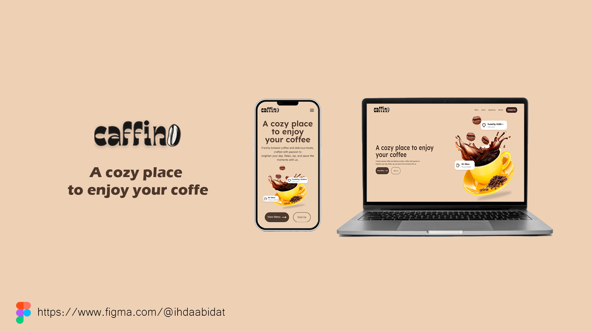

<h1 href="#top" align="center">☕Caffino</h1>
<p align="center">
  <a href="#dart-about">Sobre</a> &#xa0; | &#xa0; &#xa0;
  <a href="#rocket-technologies">Tecnologias</a> &#xa0; | &#xa0;
  <a href="#white_check_mark-requirements">Requisitos</a> &#xa0; | &#xa0;
  <a href="#checkered_flag-starting">Iniciando</a> &#xa0; | &#xa0;
  <a href="#memo-license">License</a> &#xa0; | &#xa0;
  <a href="https://github.com/{{YOUR_GITHUB_USERNAME}}" target="_blank">Author</a>
</p>

<br>

## 🎯Sobre o Projeto

Me inspirei no design do Figma da criadora <a href="https://www.figma.com/@ihdaabidat">Ihda 'Abidat</a> para criar uma landing page de uma marca fictícia chamada Caffino. O intuito do projeto é testar minhas habilidades organizando elementos numa pagina e seguir um projeto figma ja pronto
##
## 🚀 Tecnologias ##

Essas são as ferramentas/tecnologias usadas no projeto:

- [Vite](https://expo.io/)
- [Figma](https://www.figma.com/)
- [React](https://pt-br.reactjs.org/)
- [TypeScript](https://www.typescriptlang.org/)

## 📝 Requisitos ##

Antes de iniciar, é necessário ter [Git](https://git-scm.com) e [Node](https://nodejs.org/en/) instalados .

## ⚙️ Rodando o Projeto ##

```bash
# Clonando o projeto
$ git clone https://github.com/arthurnsm/Caffino.git

# Accessando a pasta 
$ cd Caffino

# Rodando
$ npm start

```